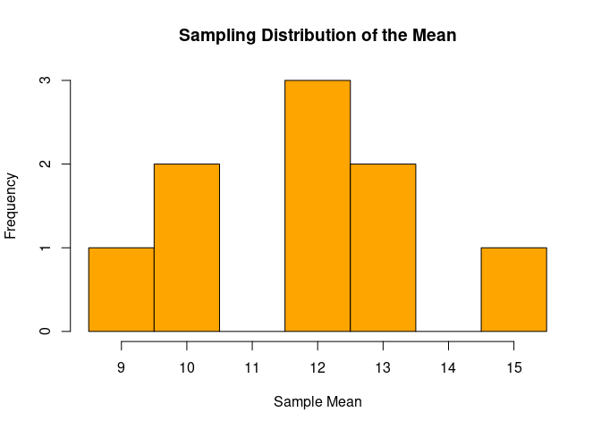

FA5_Macagba
================
2024-09-27

``` r
population <- c(9, 12, 15)


samples <- expand.grid(population, population)


sample_means <- rowMeans(samples)


hist(sample_means, breaks = seq(8.5, 15.5, by = 1), 
     main = "Sampling Distribution of the Mean", 
     xlab = "Sample Mean", 
     col = "orange", 
     border = "black")
```

<!-- -->

``` r
population_mean <- mean(population)
population_variance <- var(population)


cat("Population Mean:", population_mean, "\n")
```

    ## Population Mean: 12

``` r
cat("Variance of Sample Means (should equal variance/2):", population_variance / 2, "\n")
```

    ## Variance of Sample Means (should equal variance/2): 4.5

``` r
population <- c(3, 7, 11, 15)


population_mean <- mean(population)

population_sd <- sd(population)


sampling_mean <- population_mean


sample_size <- 2
sampling_sd <- population_sd / sqrt(sample_size)


cat("Population Mean:", population_mean, "\n")
```

    ## Population Mean: 9

``` r
cat("Population Standard Deviation:", population_sd, "\n")
```

    ## Population Standard Deviation: 5.163978

``` r
cat("Mean of the Sampling Distribution of Means:", sampling_mean, "\n")
```

    ## Mean of the Sampling Distribution of Means: 9

``` r
cat("Standard Deviation of the Sampling Distribution of Means:", sampling_sd, "\n")
```

    ## Standard Deviation of the Sampling Distribution of Means: 3.651484

``` r
n <- 200      
p <- 0.5    
q <- 1 - p  


mean_boys <- n * p
sd_boys <- sqrt(n * p * q)


p_less_40 <- pnorm(0.4 * n, mean_boys, sd_boys)
cat("Probability that less than 40% will be boys:", p_less_40, "\n")
```

    ## Probability that less than 40% will be boys: 0.002338867

``` r
num_girls_43 <- 0.43 * n
num_girls_57 <- 0.57 * n


p_between_43_57 <- pnorm(num_girls_57, mean_boys, sd_boys) - pnorm(num_girls_43, mean_boys, sd_boys)
cat("Probability that between 43% and 57% will be girls:", p_between_43_57, "\n")
```

    ## Probability that between 43% and 57% will be girls: 0.9522851

``` r
p_more_54 <- 1 - pnorm(0.54 * n, mean_boys, sd_boys)
cat("Probability that more than 54% will be boys:", p_more_54, "\n")
```

    ## Probability that more than 54% will be boys: 0.1289495

``` r
# Define the values and their probabilities
x <- c(6, 9, 12, 15, 18)
p <- c(0.1, 0.2, 0.4, 0.2, 0.1)


mean_x <- sum(x * p)


variance_x <- sum((x - mean_x)^2 * p)


cat("Mean of the distribution:", mean_x, "\n")
```

    ## Mean of the distribution: 12

``` r
cat("Population Variance of the distribution:", variance_x, "\n")
```

    ## Population Variance of the distribution: 10.8

``` r
samples <- expand.grid(x, x)


sample_means <- rowMeans(samples)


sample_probabilities <- p[as.numeric(factor(samples[,1], levels=x))] * p[as.numeric(factor(samples[,2], levels=x))]


results <- data.frame(Sample1 = samples[,1], Sample2 = samples[,2], Mean = sample_means, Probability = sample_probabilities)


print(results)
```

    ##    Sample1 Sample2 Mean Probability
    ## 1        6       6  6.0        0.01
    ## 2        9       6  7.5        0.02
    ## 3       12       6  9.0        0.04
    ## 4       15       6 10.5        0.02
    ## 5       18       6 12.0        0.01
    ## 6        6       9  7.5        0.02
    ## 7        9       9  9.0        0.04
    ## 8       12       9 10.5        0.08
    ## 9       15       9 12.0        0.04
    ## 10      18       9 13.5        0.02
    ## 11       6      12  9.0        0.04
    ## 12       9      12 10.5        0.08
    ## 13      12      12 12.0        0.16
    ## 14      15      12 13.5        0.08
    ## 15      18      12 15.0        0.04
    ## 16       6      15 10.5        0.02
    ## 17       9      15 12.0        0.04
    ## 18      12      15 13.5        0.08
    ## 19      15      15 15.0        0.04
    ## 20      18      15 16.5        0.02
    ## 21       6      18 12.0        0.01
    ## 22       9      18 13.5        0.02
    ## 23      12      18 15.0        0.04
    ## 24      15      18 16.5        0.02
    ## 25      18      18 18.0        0.01

``` r
cat("Total Probability:", sum(results$Probability), "\n")
```

    ## Total Probability: 1
