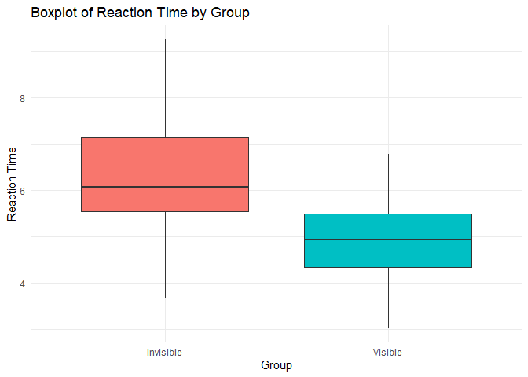

FA7_Macagba
================
2024-10-04

``` r
knitr::opts_chunk$set(echo = TRUE)

library(ggplot2)
library(dplyr)
```

    ## 
    ## Attaching package: 'dplyr'

    ## The following objects are masked from 'package:stats':
    ## 
    ##     filter, lag

    ## The following objects are masked from 'package:base':
    ## 
    ##     intersect, setdiff, setequal, union

``` r
library(car)    
```

    ## Loading required package: carData

    ## 
    ## Attaching package: 'car'

    ## The following object is masked from 'package:dplyr':
    ## 
    ##     recode

``` r
cloak_data <- read.csv("C:/Users/Jec/Downloads/Invisibility Cloak.csv")
set.seed(123)
cloak_data <- data.frame(
  Group = rep(c("Visible", "Invisible"), each = 30),
  ReactionTime = c(rnorm(30, mean = 5, sd = 1), rnorm(30, mean = 6, sd = 1.5))
)
head(cloak_data)
```

    ##     Group ReactionTime
    ## 1 Visible     4.439524
    ## 2 Visible     4.769823
    ## 3 Visible     6.558708
    ## 4 Visible     5.070508
    ## 5 Visible     5.129288
    ## 6 Visible     6.715065

``` r
#1
str(cloak_data)
```

    ## 'data.frame':    60 obs. of  2 variables:
    ##  $ Group       : chr  "Visible" "Visible" "Visible" "Visible" ...
    ##  $ ReactionTime: num  4.44 4.77 6.56 5.07 5.13 ...

``` r
#2
levels(as.factor(cloak_data$Group))
```

    ## [1] "Invisible" "Visible"

``` r
#4
shapiro.test(cloak_data$ReactionTime[cloak_data$Group == "Visible"])
```

    ## 
    ##  Shapiro-Wilk normality test
    ## 
    ## data:  cloak_data$ReactionTime[cloak_data$Group == "Visible"]
    ## W = 0.97894, p-value = 0.7966

``` r
shapiro.test(cloak_data$ReactionTime[cloak_data$Group == "Invisible"])
```

    ## 
    ##  Shapiro-Wilk normality test
    ## 
    ## data:  cloak_data$ReactionTime[cloak_data$Group == "Invisible"]
    ## W = 0.98662, p-value = 0.9614

``` r
ggplot(cloak_data, aes(sample = ReactionTime)) +
  geom_qq() + 
  geom_qq_line() + 
  facet_wrap(~Group) + 
  labs(title = "Q-Q Plot of Reaction Times by Group", y = "Sample Quantiles", x = "Theoretical Quantiles")
```

<!-- -->

``` r
t_test <- t.test(ReactionTime ~ Group, data = cloak_data, var.equal = TRUE)  # Use var.equal = FALSE if variances are not equal
t_test
```

    ## 
    ##  Two Sample t-test
    ## 
    ## data:  ReactionTime by Group
    ## t = 4.5254, df = 58, p-value = 3.041e-05
    ## alternative hypothesis: true difference in means between group Invisible and group Visible is not equal to 0
    ## 95 percent confidence interval:
    ##  0.733118 1.896105
    ## sample estimates:
    ## mean in group Invisible   mean in group Visible 
    ##                6.267508                4.952896

``` r
#5
leveneTest(ReactionTime ~ Group, data = cloak_data)
```

    ## Warning in leveneTest.default(y = y, group = group, ...): group coerced to
    ## factor.

    ## Levene's Test for Homogeneity of Variance (center = median)
    ##       Df F value Pr(>F)
    ## group  1  1.0941 0.2999
    ##       58

``` r
ggplot(cloak_data, aes(x = Group, y = ReactionTime, fill = Group)) +
  geom_boxplot() +
  labs(title = "Boxplot of Reaction Time by Group", x = "Group", y = "Reaction Time") +
  theme_minimal() +
  theme(legend.position = "none")
```

<!-- -->

``` r
p_value <- t_test$p.value
t_statistic <- t_test$statistic


if (p_value < 0.05) {
  conclusion <- "There is a statistically significant difference in Reaction Time between the Visible and Invisible groups (p < 0.05)."
} else {
  conclusion <- "There is no statistically significant difference in Reaction Time between the Visible and Invisible groups (p > 0.05)."
}


cat(conclusion)
```

    ## There is a statistically significant difference in Reaction Time between the Visible and Invisible groups (p < 0.05).
