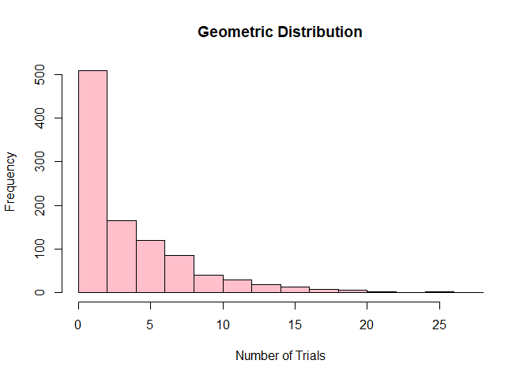

Geometric Distribution. Provide an R code for the geometric
distribution. The geometric distribution is a probability distribution
that models the number of trials required to achieve the first success
in a sequence of Bernoulli trials, where each trial has a constant
probability of success.

    #probability of success
    p <- 0.2

    #Generate 1000 random variables from the geometric distribution.
    x <- rgeom(1000,p)

    #Calculate some basic statistics:
    mean_x <- mean(x)
    var_x <- var(x)
    sd_x <- sd(x)

    cat("Number of trials required to achieve first success:\n\n")

    ## Number of trials required to achieve first success:

    cat("Mean (in 2 decimal places): ", sprintf("%.2f", mean_x), "\n")

    ## Mean (in 2 decimal places):  3.86

    cat("Variance (in 2 decimal places): ", sprintf("%.2f", var_x), "\n")

    ## Variance (in 2 decimal places):  18.77

    cat("Standard deviation (in 2 decimal places): ", sprintf("%.2f", sd_x), "\n")

    ## Standard deviation (in 2 decimal places):  4.33

    # Plot the histogram
    hist(x, main = "Geometric Distribution", xlab = "Number of Trials", 
         ylab = "Frequency", col = "pink", border = "black")

Hypergeometric Distribution. Consider a plant manufacturing IC chips of
which 10% are expected to be defective. The chips are packed in boxes
for export. Before transportation, a sample is drawn from each box.
Estimate the probability that the sample contains more than 10%
defectives, when: 1) A sample of 10 is selected from a box of 40; 1) A
sample of 10 is selected from a box of 5000.

    hypergeometric <- function(X,Y,Z,r){
      choose(Y,r) * choose(X-Y,Z-r) / choose(X,Z)
    }

    X1 <- 40
    Y1 <- 0.10 *X1
    Z1 <- 10

    problem1 <- sum(sapply(0:(0.10 * Z1), function(r) hypergeometric(X1, Y1, Z1, r)))
    problem1

    ## [1] 0.7441186

    X2 <- 5000
    Y2 <- 0.10 * X2
    Z2 <- 10

    problem2 <- sum(sapply(0:(0.10 * Z2), function(r) hypergeometric(X2, Y2, Z2, r)))
    problem2

    ## [1] 0.7361378
