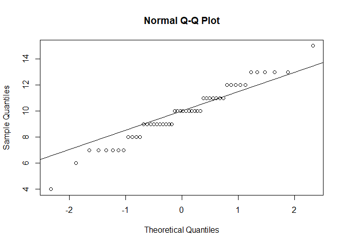
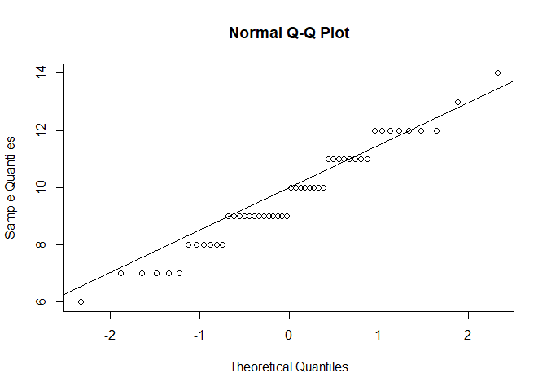

SA1_Macagba
================
2024-10-11

``` r
male_hours <- c(12, 4, 11, 13, 11, 7, 9, 10, 10, 7, 7, 12, 6, 9, 15, 10, 11, 12, 7, 8, 8, 9, 11, 10, 9, 10, 9, 9, 7, 9, 11, 7, 10, 10, 11, 9, 12, 12, 8, 13, 9, 10, 8, 11, 10, 13, 13, 9, 10, 13)

female_hours <- c(11, 9, 7, 10, 9, 10, 10, 7, 9, 10, 11, 8, 9, 6, 11, 10, 7, 9, 12, 14, 11, 12, 12, 8, 12, 12, 9, 10, 11, 7, 12, 7, 9, 8, 11, 10, 8, 13, 8, 10, 9, 9, 9, 11, 9, 9, 8, 9, 12, 11)

combined_hours <- c(male_hours, female_hours)


group <- factor(rep(c("Male", "Female"), each = length(male_hours)))
```

``` r
#(10 points). Formulate and present the rationale for a hypothesis test that the researcher could use to compare the mean time spent on cell phones by male and female college students per week.
library(car)
```

    ## Loading required package: carData

``` r
# Combine data and group
combined_hours <- c(male_hours, female_hours)
group <- factor(rep(c("Male", "Female"), each = 50))

# Levene's Test for equality of variances
leveneTest(combined_hours ~ group)
```

    ## Levene's Test for Homogeneity of Variance (center = median)
    ##       Df F value Pr(>F)
    ## group  1  0.6943 0.4067
    ##       98

``` r
qqnorm(male_hours); qqline(male_hours)
```

<!-- -->

``` r
qqnorm(female_hours); qqline(female_hours)
```

<!-- -->

``` r
t_test_result <- t.test(male_hours, female_hours, var.equal = TRUE)
t_test_result
```

    ## 
    ##  Two Sample t-test
    ## 
    ## data:  male_hours and female_hours
    ## t = 0.30395, df = 98, p-value = 0.7618
    ## alternative hypothesis: true difference in means is not equal to 0
    ## 95 percent confidence interval:
    ##  -0.6634737  0.9034737
    ## sample estimates:
    ## mean of x mean of y 
    ##      9.82      9.70

``` r
mean_male <- mean(male_hours)
sd_male <- sd(male_hours)
ci_male <- t.test(male_hours)$conf.int

mean_female <- mean(female_hours)
sd_female <- sd(female_hours)
ci_female <- t.test(female_hours)$conf.int

# Display descriptive statistics
list(
  Mean_Male = mean_male, SD_Male = sd_male, CI_Male = ci_male,
  Mean_Female = mean_female, SD_Female = sd_female, CI_Female = ci_female
)
```

    ## $Mean_Male
    ## [1] 9.82
    ## 
    ## $SD_Male
    ## [1] 2.154161
    ## 
    ## $CI_Male
    ## [1]  9.207794 10.432206
    ## attr(,"conf.level")
    ## [1] 0.95
    ## 
    ## $Mean_Female
    ## [1] 9.7
    ## 
    ## $SD_Female
    ## [1] 1.775686
    ## 
    ## $CI_Female
    ## [1]  9.195356 10.204644
    ## attr(,"conf.level")
    ## [1] 0.95

``` r
#Analyze the data to provide the hypothesis testing conclusion. What is the p-value for your test? What is your recommendation for the researcher?

t_test_result <- t.test(male_hours, female_hours, var.equal = TRUE)
t_test_result
```

    ## 
    ##  Two Sample t-test
    ## 
    ## data:  male_hours and female_hours
    ## t = 0.30395, df = 98, p-value = 0.7618
    ## alternative hypothesis: true difference in means is not equal to 0
    ## 95 percent confidence interval:
    ##  -0.6634737  0.9034737
    ## sample estimates:
    ## mean of x mean of y 
    ##      9.82      9.70

``` r
cat("We fail to reject the null hypothesis based")
```

    ## We fail to reject the null hypothesis based

``` r
male_summary <- c(
  Mean = mean(male_hours),
  SD = sd(male_hours),
  Min = min(male_hours),
  Max = max(male_hours),
  Median = median(male_hours)
)


female_summary <- c(
  Mean = mean(female_hours),
  SD = sd(female_hours),
  Min = min(female_hours),
  Max = max(female_hours),
  Median = median(female_hours)
)


summary_stats <- data.frame(
  Statistic = c("Mean", "Standard Deviation", "Minimum", "Maximum", "Median"),
  Male = male_summary,
  Female = female_summary
)


summary_stats
```

    ##                 Statistic      Male    Female
    ## Mean                 Mean  9.820000  9.700000
    ## SD     Standard Deviation  2.154161  1.775686
    ## Min               Minimum  4.000000  6.000000
    ## Max               Maximum 15.000000 14.000000
    ## Median             Median 10.000000  9.500000

``` r
ci_male <- t.test(male_hours)$conf.int
ci_male
```

    ## [1]  9.207794 10.432206
    ## attr(,"conf.level")
    ## [1] 0.95

``` r
ci_female <- t.test(female_hours)$conf.int
ci_female
```

    ## [1]  9.195356 10.204644
    ## attr(,"conf.level")
    ## [1] 0.95

``` r
ci_diff <- t.test(male_hours, female_hours, var.equal = TRUE)$conf.int
ci_diff
```

    ## [1] -0.6634737  0.9034737
    ## attr(,"conf.level")
    ## [1] 0.95

``` r
mean_male <- mean(male_hours)
mean_female <- mean(female_hours)
sd_male <- sd(male_hours)
sd_female <- sd(female_hours)


n_male <- length(male_hours)
n_female <- length(female_hours)
pooled_sd <- sqrt(((n_male - 1) * sd_male^2 + (n_female - 1) * sd_female^2) / (n_male + n_female - 2))


effect_size_d <- abs(mean_male - mean_female) / pooled_sd
effect_size_d
```

    ## [1] 0.06078982

``` r
se_male <- sd_male / sqrt(n_male)
se_female <- sd_female / sqrt(n_female)


ci_diff <- t.test(male_hours, female_hours, var.equal = TRUE)$conf.int
ci_width_diff <- diff(ci_diff)


list(
  Effect_Size_Cohens_d = effect_size_d,
  SE_Male = se_male,
  SE_Female = se_female,
  CI_Width_Difference = ci_width_diff
)
```

    ## $Effect_Size_Cohens_d
    ## [1] 0.06078982
    ## 
    ## $SE_Male
    ## [1] 0.3046443
    ## 
    ## $SE_Female
    ## [1] 0.2511199
    ## 
    ## $CI_Width_Difference
    ## [1] 1.566947
