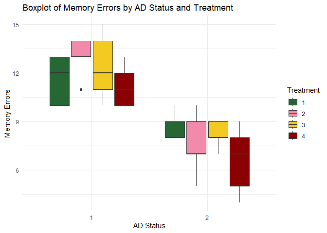
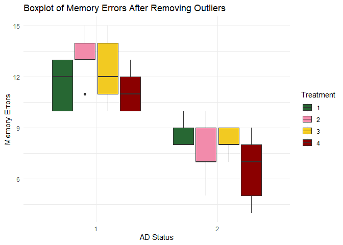
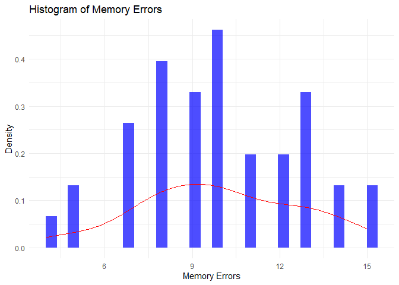

SA 2 - Comparing Memory Day Errors on Drug Treatments and AD Status
================
Jan Edward Macagva

# Load Data

``` r
df <- read.csv("C:\\Users\\Jec\\Downloads\\Alzheimers Mice Data.csv")
head(df, 10)
```

    ##    AD_Status Treatment Training Memory
    ## 1          1         1       12     10
    ## 2          1         1       15     12
    ## 3          1         1       13     13
    ## 4          1         1       12     10
    ## 5          1         1       14     13
    ## 6          1         2       15     13
    ## 7          1         2       17     13
    ## 8          1         2       16     14
    ## 9          1         2       17     15
    ## 10         1         2       14     11

## Assumptions

**Assumption 1**: The dependent variable is measured on a continuous
scale.

**Assumption 2**: The two independent variables (AD Status and
Treatment) consist of categorical groups. AD Status is a dichotomous
variable, while Treatment has four categories.

**Assumption 3**: Observations within each group of the independent
variables are independent of each other.

**Assumption 4**: There are no outliers in the data.

**Assumption 5**: The dependent variable exhibits a normal distribution.

**Assumption 6**: The dependent variable shows equal variance across
groups.

# Introduction

This analysis investigates the impact of Alzheimer’s Disease (AD) and
various treatments on training errors. Training errors are quantified as
the number of mistakes made during the training phase.

### Independent Variables:

**AD Status:** 1. The mouse has AD.  
2. The mouse does not have AD.

**Treatment:** Divided into four categories (1, 2, 3, and 4).. \####
Hypotheses

**Main Effect of AD Status** - $H_0$: There is no significant difference
in memory day errors between mice with AD and those without AD. - $H_1$:
There is a significant difference in memory day errors between mice with
AD and those without AD.

**Main Effect of Treatment** - $H_0$: There is no significant difference
in memory day errors across treatment groups. - $H_1$: There is a
significant difference in memory day errors across treatment groups.

**Interaction between AD Status and Treatment** - $H_0$: There is no
significant interaction between AD Status and Treatment on memory day
errors. - $H_1$: There is a significant interaction between AD Status
and Treatment on memory day errors.

# Descriptive Analysis

``` r
summary(df$Memory)
```

    ##    Min. 1st Qu.  Median    Mean 3rd Qu.    Max. 
    ##   4.000   8.000  10.000   9.925  12.000  15.000

**Remark**: The dataset contains two independent variables, one with two
levels and the other with four levels. The dependent variable is
continuous. Therefore, **Assumptions 1 and 2 are satisfied.**

``` r
grouped_result <- df %>% 
  group_by(AD_Status, Treatment) %>% 
  summarise(mean_memory = mean(Memory, na.rm = TRUE))
```

    ## `summarise()` has grouped output by 'AD_Status'. You can override using the
    ## `.groups` argument.

``` r
print(grouped_result)
```

    ## # A tibble: 8 × 3
    ## # Groups:   AD_Status [2]
    ##   AD_Status Treatment mean_memory
    ##       <int>     <int>       <dbl>
    ## 1         1         1        11.6
    ## 2         1         2        13.2
    ## 3         1         3        12.4
    ## 4         1         4        11.2
    ## 5         2         1         8.6
    ## 6         2         2         7.6
    ## 7         2         3         8.2
    ## 8         2         4         6.6

**Remark**: Observations exist for all combinations of the independent
variables. Therefore, **Assumption 3 is satisfied.**

``` r
ggplot(df, aes(x = as.factor(AD_Status), y = Memory, fill = as.factor(Treatment))) +
  geom_boxplot() +
  scale_fill_manual(values = c("#276733", "#F28BAB", "#F2CA22", "#8B0000")) +
  labs(title = "Boxplot of Memory Errors by AD Status and Treatment",
       x = "AD Status",
       y = "Memory Errors",
       fill = "Treatment") +
  theme_minimal()
```

<!-- -->

## Remove Outliers

``` r
remove_outliers <- function(df) {
  df %>% 
    mutate(across(everything(), ~ ifelse(. < quantile(., 0.25) - 1.5 * IQR(.), NA, 
                                         ifelse(. > quantile(., 0.75) + 1.5 * IQR(.), NA, .))))
}

filtered_data <- remove_outliers(df)

filtered_data <- na.omit(filtered_data)

ggplot(filtered_data, aes(x = as.factor(AD_Status), y = Memory, fill = as.factor(Treatment))) +
  geom_boxplot() +
  scale_fill_manual(values = c("#276733", "#F28BAB", "#F2CA22", "#8B0000")) +
  labs(title = "Boxplot of Memory Errors After Removing Outliers",
       x = "AD Status",
       y = "Memory Errors",
       fill = "Treatment") +
  theme_minimal()
```

<!-- -->

**Remark**: After removing outliers using the IQR method, no significant
outliers remain. Therefore, **Assumption 4 is satisfied.**

## Normality Check

``` r
ggplot(df, aes(x = Memory)) +
  geom_histogram(aes(y = ..density..), bins = 30, fill = "blue", alpha = 0.7) +
  geom_density(color = "red") +
  labs(title = "Histogram of Memory Errors",
       x = "Memory Errors",
       y = "Density") +
  theme_minimal()
```

    ## Warning: The dot-dot notation (`..density..`) was deprecated in ggplot2 3.4.0.
    ## ℹ Please use `after_stat(density)` instead.
    ## This warning is displayed once every 8 hours.
    ## Call `lifecycle::last_lifecycle_warnings()` to see where this warning was
    ## generated.

<!-- -->

**Remark**: The histogram suggests that memory errors are approximately
normally distributed. Therefore, **Assumption 5 is satisfied, with
caution.**

## Homogeneity of Variances

``` r
grouped <- split(df$Memory, list(df$AD_Status, df$Treatment))
levene_test <- leveneTest(Memory ~ as.factor(AD_Status) * as.factor(Treatment), data = df)
levene_test
```

    ## Levene's Test for Homogeneity of Variance (center = median)
    ##       Df F value Pr(>F)
    ## group  7  0.8275 0.5722
    ##       32

**Remark**: The p-value for Levene’s test exceeds 0.05, indicating
homogeneity of variances. Therefore, **Assumption 6 is satisfied.**

# Inferential Analysis

## Two-Way ANOVA

``` r
anova_model <- aov(Memory ~ as.factor(AD_Status) * as.factor(Treatment), data = df)
anova_table <- summary(anova_model)
anova_table
```

    ##                                           Df Sum Sq Mean Sq F value   Pr(>F)
    ## as.factor(AD_Status)                       1 189.22  189.22  75.313 6.45e-10
    ## as.factor(Treatment)                       3  14.48    4.83   1.920    0.146
    ## as.factor(AD_Status):as.factor(Treatment)  3   8.67    2.89   1.151    0.344
    ## Residuals                                 32  80.40    2.51                 
    ##                                              
    ## as.factor(AD_Status)                      ***
    ## as.factor(Treatment)                         
    ## as.factor(AD_Status):as.factor(Treatment)    
    ## Residuals                                    
    ## ---
    ## Signif. codes:  0 '***' 0.001 '**' 0.01 '*' 0.05 '.' 0.1 ' ' 1

# Discussion

Based on the two-way ANOVA results, the following conclusions were
drawn: 1. AD status significantly affects memory errors. 2. Treatment
type does not significantly affect memory errors. 3. The interaction
between AD status and treatment does not significantly affect memory
errors.

# Conclusion

After completing this analysis, the following conclusions are made:

- There is a significant difference in memory day errors between mice
  with and without AD. Thus, **we reject the null hypothesis $(H_0)$.**
- There is no significant difference in memory day errors among the four
  treatment groups. Thus, **we accept the null hypothesis $(H_0)$.**
- There is no significant interaction between AD status and treatment on
  memory day errors. Thus, **we accept the null hypothesis $(H_0)$.**
