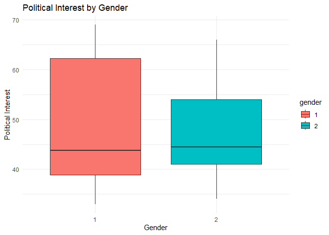
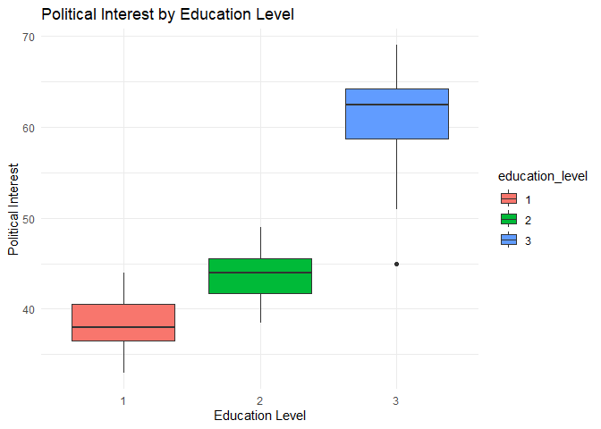
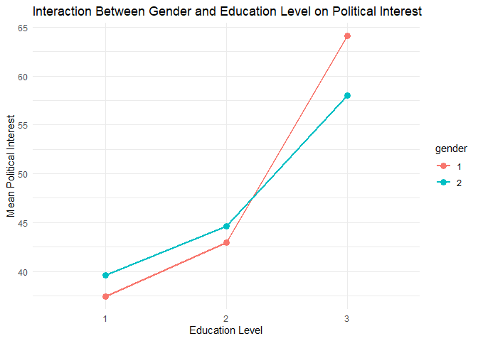

FA_9
================
2024-11-14

``` r
data <- read.csv("C:\\Users\\Jec\\Documents\\FEU\\Stat Theory\\Political Interest.csv")


data$gender <- as.factor(data$gender)
data$education_level <- as.factor(data$education_level)


anova_result <- aov(political_interest ~ gender * education_level, data = data)


summary(anova_result)
```

    ##                        Df Sum Sq Mean Sq F value  Pr(>F)    
    ## gender                  1     26    25.7   1.788 0.18704    
    ## education_level         2   5410  2705.0 188.136 < 2e-16 ***
    ## gender:education_level  2    210   105.2   7.315 0.00159 ** 
    ## Residuals              52    748    14.4                    
    ## ---
    ## Signif. codes:  0 '***' 0.001 '**' 0.01 '*' 0.05 '.' 0.1 ' ' 1

``` r
library(ggplot2)


ggplot(data, aes(x = gender, y = political_interest, fill = gender)) +
  geom_boxplot() +
  labs(title = "Political Interest by Gender",
       x = "Gender",
       y = "Political Interest") +
  theme_minimal()
```

<!-- -->

``` r
ggplot(data, aes(x = education_level, y = political_interest, fill = education_level)) +
  geom_boxplot() +
  labs(title = "Political Interest by Education Level",
       x = "Education Level",
       y = "Political Interest") +
  theme_minimal()
```

<!-- -->

``` r
interaction_plot <- ggplot(data, aes(x = education_level, y = political_interest, color = gender, group = gender)) +
  stat_summary(fun = mean, geom = "line", size = 1) +
  stat_summary(fun = mean, geom = "point", size = 3) +
  labs(title = "Interaction Between Gender and Education Level on Political Interest",
       x = "Education Level",
       y = "Mean Political Interest") +
  theme_minimal()
```

    ## Warning: Using `size` aesthetic for lines was deprecated in ggplot2 3.4.0.
    ## ℹ Please use `linewidth` instead.
    ## This warning is displayed once every 8 hours.
    ## Call `lifecycle::last_lifecycle_warnings()` to see where this warning was
    ## generated.

``` r
print(interaction_plot)
```

<!-- -->
